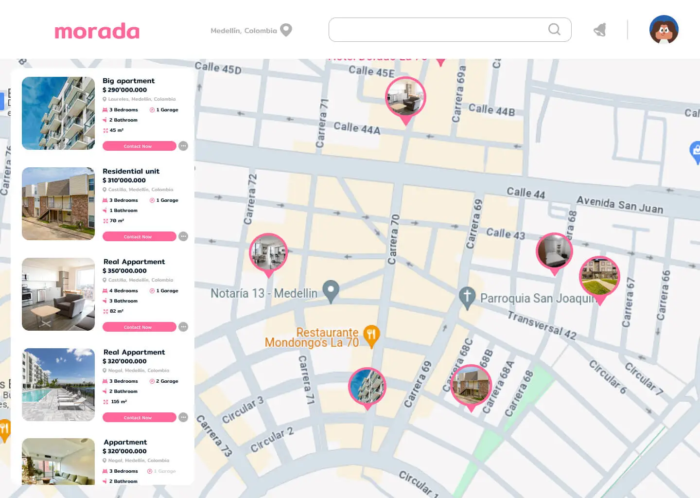

# Morada 

## Descripción
Morada Inmobiliaria Directa es una plataforma que conecta directamente a personas interesadas en comprar o vender propiedades, eliminando intermediarios.

## Características Principales
- **Publicaciones de Propiedades:** Los usuarios pueden crear y gestionar fácilmente publicaciones de propiedades.
- **Búsqueda Avanzada:** Potente motor de búsqueda para encontrar propiedades según criterios específicos.
- **Chat Integrado:** Comunicación directa entre compradores y vendedores a través de un sistema de chat integrado.
- **Monetización con Google AdSense:** Genera ingresos mediante la integración de anuncios de Google AdSense.

## Tecnologías Utilizadas
- **Frontend:** React.js
- **Backend:** Firebase (Firestore, Authentication)
- **Monetización:** Google AdSense
- **Otros:** (Incluye cualquier otra tecnología que estés utilizando)